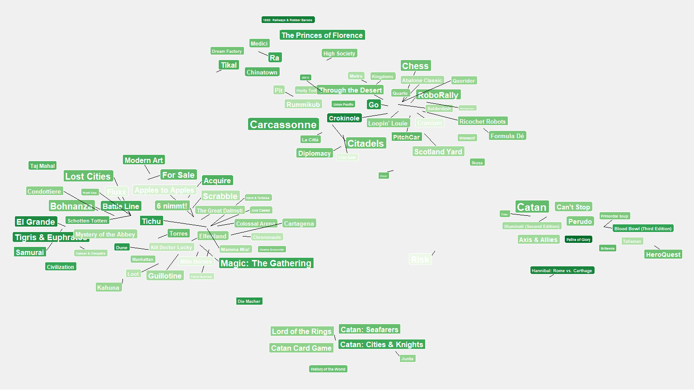

Board Game Geek-Out
================
Jordan Upton

This project was an attempt to extract data from the API at [boardgamegeek](https://www.boardgamegeek.com) and use it to generate visualizations. This was my first time working with XML data in R and it was a little frustrating. XML seems to have a natural stucture to it, yet I couldn't find a good way to automatically extract that structure into a number of related data frames.

The visuals use the first two principal components of the game's mechanics to place it on a scatter plot. This leaves us with clusters of games that have similar mechanics; e.g. dice games vs card games. Each game's size and color are determined by the number and favorability of reviews, repectively. Here's an example for the top 100 most reveiewed games out of the first 1000 ids in BGG's database.

